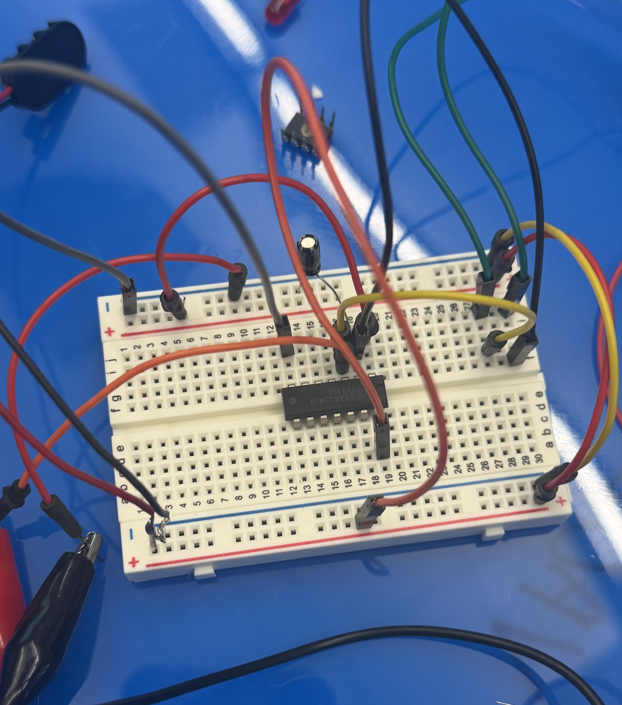
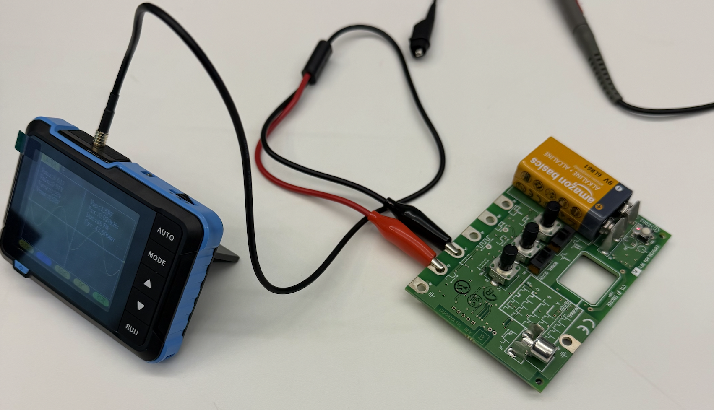

[<](README.md)

# Week 03 - DevLog

## Outcomes 

<!-- 
Using the backslash preserves the list number 
https://stackoverflow.com/a/50916345/441878 
-->

1\. 📚 Read Chapter 03 - The Hello World Oscillator (39-45) in [Electronic music from scratch](https://www.makershed.com/products/make-electronic-music-pdf) (Pearson). Write a comment on one of Pearson's phrases that speaks to you. (2-3 sentences) 

- A phrase that stood out to me was when Pearson says that “an electronic appliance uses electricity as a language.” I like how it reframes electronics as systems that communicate rather than just consume power. It helped me understand why small changes in voltage can completely change a circuit’s behavior, especially in sound synthesis.

2\. Follow instructions in "My First Square Wave Oscillator" experiment (Pearson 59-71) to create a breadboard oscillator. Share a photo.

- 

3\. Create at least one variation on your oscillator inspired by four variations on the circuit. Share a video of your your device.

- For my variation, I replaced the potentiometer with the “Pinch-O-Matic” method using two jumper wires connected to pins 2 and 3. Pinching the wires together changed the pitch depending on pressure.

4\. 📚 Read Chapter 4 - Amps, Reverbs, and Talkboxes (72-75) in [Electronic music from scratch](https://www.makershed.com/products/make-electronic-music-pdf) (Pearson). 

5\. Once you start listening you'll hear it everywhere. Share a link to a song that uses a synthesizer below.

- [Daft Punk - "Veridis Quo"](https://www.youtube.com/watch?v=TCd6PfxOy0Y&list=RDTCd6PfxOy0Y&start_radio=1)

6\. Watch Synthesizer Basics: Amplitude, Oscillators, Timbre and describe
https://www.youtube.com/watch?v=c3udLCvoCC0 

- The video explains the basic parts of a synthesizer, like oscillators, frequency, and amplitude, and how they work together to create sound. It also talks about envelopes and filters, showing how sounds change over time and how their tone can be shaped. Overall, it connects these ideas to how modulation adds movement to a sound.

7\. What is the difference between an analog and digital component?

- Analog components work with continuous signals that can vary smoothly over time. Digital components operate using discrete values, which are usually represented as binary states. Furthermore analog signals more closely resemble natural sound waves, while digital signals rely on sampling and numerical representation.

8\. [👉Activity: Analyze square waveforms with an oscilloscope](https://docs.google.com/presentation/d/1G4jdcr8KzWpIiIduQyFiQJEG-PFJHpovJb9rWhxhNYw/edit?slide=id.g3b8d920f8b7_0_49#slide=id.g3b8d920f8b7_0_49). On the Snap-on Waveform demo board, which pot controls variable voltage (duty cycle) and which controls variable frequency (PWM slides)? What is a common use of each? 

- The duty cyclenpot controls the width of the square wave and the frequency pot controls how fast the wave repeats. Duty cycle is commonly used for PWM slides to control brightness or tone and frequency is used to control pitch in audio applications.

9\. Post a photo of your Snapon board testing.

- 

10\. List one thing you learned in the [Learning Synth Playground](https://learningsynths.ableton.com/en/playground) by Ableton 

- One thing I learned was how filters dramatically change a sound by removing certain frequencies. Small adjustments to cutoff and resonance made big differences,

## Other experiments

<!-- 
Share details about other electronic experiments you are working on this week?
-->

- 

## Questions to bring up in class

<!-- 
Share questions you would like to bring up in class.
-->

- 