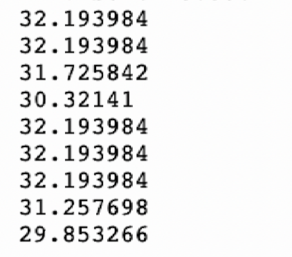

[<](README.md)

# Week 05 - DevLog

## Outcomes 

<!-- 
Using the backslash preserves the list number 
https://stackoverflow.com/a/50916345/441878 
-->

1\. 📚Read Chapter 5 (58-67) Physical Computing with Pico. Post documentation of your Traffic light controller

2\. 📚Read Chapter 6 (68-79) Physical Computing with Pico. Post documentation of your Reaction Game

3\. Post documentation showing data from an analog sensor.

- Did in class already, but will redo with images. 

4\. 📚Read Brian Merchant [Everything That’s Inside Your iPhone](https://www.vice.com/en/article/everything-thats-inside-your-iphone/) Motherboard (2017). ✏️ Write a reflection below:

- I found Everything That’s Inside Your iPhone really interesting because it broke down something I use every day but never really think about. I didn’t realize how many different countries, materials, and labor systems are involved in making one phone. It made me more aware of how disconnected we are from the physical and human cost behind our technology. As someone studying computer science, it pushed me to think beyond just code and consider the bigger systems that make computing possible.

5\. 📚Read Chapter 7 (80-91) Physical Computing with Pico. Post documentation of your Burglar Alarm.

6\. 📚Read Chapter 8 (92-103 ) Physical Computing with Pico. Post documentation of your Temperature gauge.

7\. Post documentation showing audio from your Pico

8\. Post documentation showing audio from your Pico

9\. Post documentation of your progress on the Musical Instrument

10\. Post documentation of your progress on the Musical Instrument

## Other experiments

<!-- 
Share details about other electronic experiments you are working on this week?
-->

- 

## Questions to bring up in class

<!-- 
Share questions you would like to bring up in class.
-->

- 