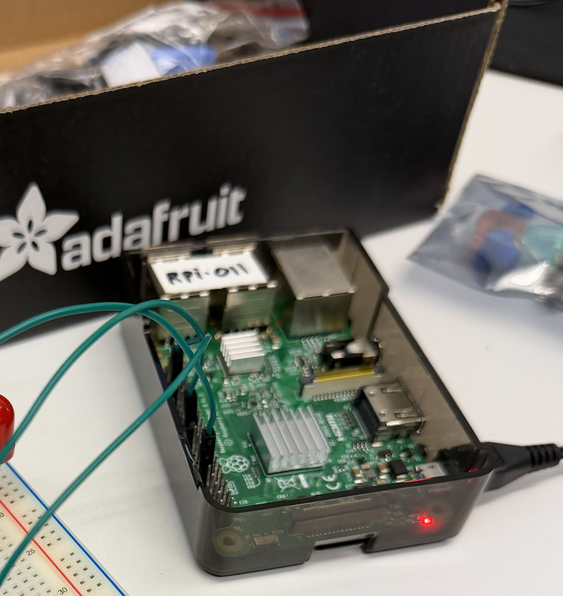
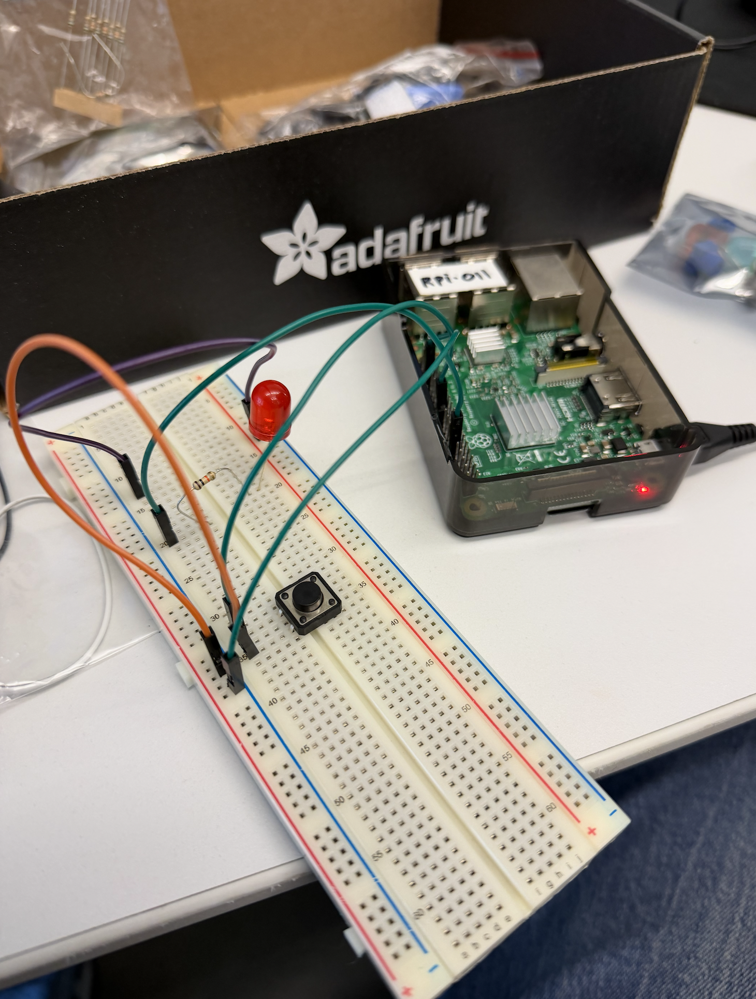

[<](README.md)

# DevLog 07

> Use git, python, and GPIO connections to turn on LEDs, read sensors

## Outcomes 

<!-- 
Using the backslash preserves the list number 
https://stackoverflow.com/a/50916345/441878 
-->

1\. Turn `on` and `off` an LED using the command line, GPIO and python. ✏️

- Post video documentation here

2\. Clone a repo to your Raspberry Pi over SSH ✏️ 

- Link to the repo you cloned: 

3\. Run a python script in the repository

- n/a

4\. Read a button (connected to a pulldown resistor) with your RPi and use the value to control an LED. ✏️

5\. Connect to your Pi over SFTP and upload / download files ✏️

- Post a screenshot from your FTP program here

6\. Fade an LED using PWM from your Pi ✏️ 

- Post video documentation here

7\. Read values from a photoresistor with your Pi ✏️ 

- Post video documentation here

8\. Explore sensors in class. List two analogs and two digital sensors ✏️ 

1. Analog
2. Analog
3. Digital
4. Digital

9\. Use a relay to safely control a higher power voltage with your Pi ✏️ 

- Post video documentation here

10\. Link to your final project pitch ✏️ 

- [Project Pitch](https://docs.google.com/presentation/d 1VqIB3bkH_3fzEpuZbiaO9ymmxzOHz04kzD8C0naZKZs/edit?usp=sharing)

## Other experiments

<!-- 
Share other electronic experiments from this week?
-->

- 

## Questions to bring up in class

<!-- 
Share questions you would like to bring up in class.
-->

- 